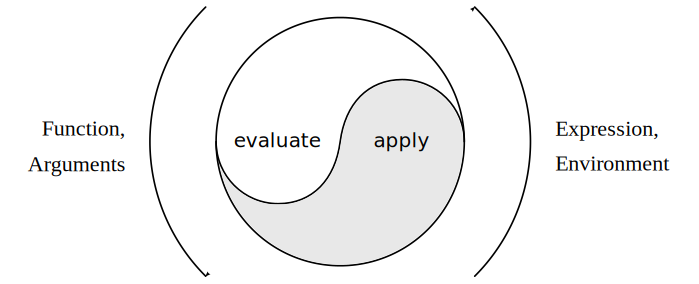
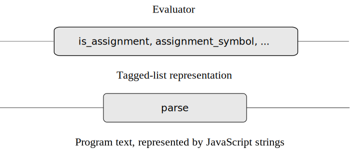

求值过程可以描述为两个过程 evaluate 和 apply 之间的相互作用

---

### evaluate

参数是一个表达式一个环境, `evaluate ` 对表达式分类，不同类型调用不同函数去求值

**Primitive expressions**

- 字面量表达式（例如数字）返回它的值
- evaluate 在环境中查找变量，找到值

**Syntactic forms**

- 条件表达式对各部分特殊处理，在条件为真时求值对应部分，否则求值替代部分
- 把 lambda 表达式的参数和函数体还有求值环境打包，将其转为适用的函数
- 语句序列按出现顺序求值
- 块内需要在当前块的新环境中求值
- return 语句必须产生一个值，该值成为所属函数的返回值
- 函数声明转为常量声明，然后求值
- 常量或两边声明必须递归调用 evaluate 来求值

**Combinations**

- `evaluate` 必须递归计算应用程序的函数表达式和参数表达式。生成的函数和参数将传递给 `apply` ，它处理实际的函数应用程序

- 运算符组合被转换为函数应用程序，然后进行评估

```javascript
function evaluate(component, env) {
  return is_literal(component)
    ? literal_value(component)
    : is_name(component)
    ? lookup_symbol_value(symbol_of_name(component), env)
    : is_application(component)
    ? apply(
        evaluate(function_expression(component), env),
        list_of_values(arg_expressions(component), env),
      )
    : is_operator_combination(component)
    ? evaluate(operator_combination_to_application(component), env)
    : is_conditional(component)
    ? eval_conditional(component, env)
    : is_lambda_expression(component)
    ? make_function(lambda_parameter_symbols(component), lambda_body(component), env)
    : is_sequence(component)
    ? eval_sequence(sequence_statements(component), env)
    : is_block(component)
    ? eval_block(component, env)
    : is_return_statement(component)
    ? eval_return_statement(component, env)
    : is_function_declaration(component)
    ? evaluate(function_decl_to_constant_decl(component), env)
    : is_declaration(component)
    ? eval_declaration(component, env)
    : is_assignment(component)
    ? eval_assignment(component, env)
    : error(component, 'unknown syntax -- evaluate');
}
```

### apply

函数 `apply` 接受两个参数，一个函数和一个调用该函数的参数列表

```javascript
function apply(fun, args) {
  if (is_primitive_function(fun)) {
    return apply_primitive_function(fun, args);
  } else if (is_compound_function(fun)) {
    const result = evaluate(
      function_body(fun),
      extend_environment(function_parameters(fun), args, function_environment(fun)),
    );
    return is_return_value(result) ? return_value_content(result) : undefined;
  } else {
    error(fun, 'unknown function type -- apply');
  }
}
```

### parse

parse 把文本转换为**标记列表**

`parse("const size = 2; 5 * size;"); `

转为：

```js
list("sequence",
     list(list("constant_declaration",
               list("name", "size"), list("literal", 2)),
          list("binary_operator_combination", "*",
               list("literal", 5), list("name", "size"))))
```



### [词法定义](https://sourceacademy.org/sicpjs/4.1.2)

### Literal expression 

`< literal-expression > = list("literal", value)`

- `parse("1;"); `  -> `list("literal", 1)`

- `parse("'hello world';"); ` -> `list("literal", "hello world")`

- `parse("null;"); ` -> `list("literal", null)`

### Names

`< name > = list("name", symbol)`

#### Expression statements 

不区分语句和表达式

`< expression > = < expression >`

#### Function applications 

`< fun-expre(arg-expr1, ... arg-exprn) > = list("application", < fun-expr >, list(< arg-expr1 >, ... , < arg-exprn >))`

#### Conditionals

**condition expression**

`< predicate ? consequent-expression : alternative-expression > = list("conditional_expression", < predicate >, < consequent-expression >, < alternative-expression >)`

**condition statement**

`< if (predicate) consequent-block else alternative-block > = list("conditional_statement", < predicate >, < consequent-block >, < alternative-block >)`

#### Lambda expressions

`< (name_1, …, name_n) => expression > = < (name_1, …, name_n) => { return expression; } >`

`< (name_1, …, name_n) => block > =  list("lambda_expression", list(< name_1 >, ... < name_n >, < block >))` 

#### Sequences

`< statement_1 ... statement_n > = list("sequence", list(< statement_1 ... statement_n >)`

#### Blocks

`< { statements } > = list("block", < statements >)`

#### Return statements 

`< return expression > = list("return_statement", < expression >)`

#### Assignments

`< name = expression; > = list("assignment", < name >, < expression >)`

#### Constant, variable, and function declarations

`< const name = expression; > = list("constant_declaration", < name >, < expression >)`

`< let name = expression; > = list("variable_declaration", < name >, < expression > )`

`< function name(name_1, …, name_n) block > = list("function_declaration", < name >, list(<name_1>, ... , < name_n >), < block >)`

#### Derived components

一元运算符:  **!, -(number)**

`< unary-operator expression > = list("unary_operator_combination", "unary-operator", list(< expression >))`

二元运算符：**+, -, *, /, %, ===, !==, >, <, >= ,<=**

`< expression_1 binary-operator expression_2 > = list("binary_operator_combination", "binary-operator",list(< expression_1 >, < expression_2 >))`

